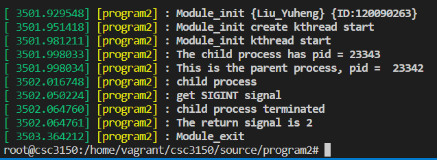

# CSC3150_Assignment1_Report 
## Liu Yuheng 120090263

## 1.Design

In this program, I need to write two programs for user mode implementation and for kernel mode implementation. 

#### **Program1**

***1) General idea***

The process for user mode is to first fork a child process to execute fifteen test programs, and the parent process will receive the SIGCHLD signals when the child process finishes execution. 

I distinguished different SIGCHLD including "SIGHUP", "SIGINT", "SIGQUIT", "SIGILL", "SIGTRAP", "SIGABRT", "SIGBUS", "SIGFPE", "SIGKILL", "SIGSEGV", "SIGPIPE", "SIGALRM", "SIGTERM", “SIGSTOP” so that the program can print corresponding signals due to different return status.

***2) Detailed information***

* In my program, I first defined different termination signals (char* TerminationSignal[ ]). Then, there is a main() function. 

* First, I call fork() to create a child process. The fork call is called only once but returns twice. In the parent process, it returns the process ID of the child process. In the child process, it returns 0. Therefore, if successfully fork child process, the program first gets into child process. I use execve() function to execute test programs and use exit() function to exit. 

* During this process, the parent process is halted and waiting for the child process by waitpid() fucntions. Then, I check different return status and print out corresponding signals. At the end of the parent process, I use exit(0) to exit it. 

Steps to test:
* make
* use ./program1 ./xxxx to test

#### **Program2**
***1) General idea***

The general idea of program2 is a little similar to program1. 

The main process is also to fork a child process and the parent process will wait until child process terminates. However, this program is implemented in kernel mode. 

Therefore, I have to first initialize kernel modules, create a kernel thread and then fork a process. After the parent process wait until the child process terminates, the kernel module exits.

***2) Detailed information***

 Preparations:

* I export functions including kernel_theard() from '/kernel/fork.c', getname_kernel() from '/fs/namei.c', do_wait() from '/kernel/exit.c', do_execve() from '/fs/exec.c' by EXPORT_SYMBOL. I copy the wait_opts{} structure of Linux 15.10.99 from '/kernel/exit.c' to my program2. I declare task_struct structure. I copy the definition of functions including WEXITSTATUS, WTERMSIG, WSTOPSIG, WIFEXITED, WIFSIGNALED, WIFSTOPPED from '/x86_64-linux-gnu/sys/wait.h' file.

Process: 

* My program includes function my_wait(), my_exec(), my_fork(), and program2_init(), progarm2_exit().

* In my_wait(), I called find_get_pid(), wait() and put_pid() in sequence, then I print termination information accordingly.

* In my_exec(), I set path (/tmp/testfor submission and /home/vagrant/csc3150/Assignment_1_120090263/xxxxx for test), argument vector, environment. I use getname_kernel() to obtain filename and use do_execve() to execute the test file. If the return value of do_execve() is 1 instead of 0, then the result has errors, otherwise the result is correct . Lastly, I use do_exit(result) as the process finishes running or exits because a system exception is triggered

* In my_fork(), first set default sigaction for current process. Then I use kernel_clone() to fork a process. However, since there are some problems caused by kernel_clone(),  including the wrong return PID, I changed the parameters to that of kernel_thread() and solve this problem. In this function, I called my_wait().

* program2_init() is for creating a kernel thread to run my_fork(), which will use kthread_create() and use IS_ERR() to judge whether the process is successful. If so, it use wake_up_process() to wake up new thread. 

* progarm2_exit() marks the end of whole program2.

Steps to test:
* use gcc test.c -o test to compile test files
* change the path to corresponding files
* make
* insert and remove module: insmod program2.ko, rmmod program2.o
* use dmesg to check output.

## 2. Set development environment
* Linux version:5.10.99

* Ubuntu version:16.04.12

* Virtual Box 6.1

**steps:** 
1. set up virtual machine
   1. install virtualbox and vagrant
   2. make a directory for csc3150
   3. Launch powershell with Administrator previlege and change current directory to execute 'vagrant init cyzhu/csc3150'
   4. execute vagrant up
   5. execute vagrant ssh
2. set up VS Code
   1. download Remote SSH
   2. go to the remote explorer tab, click config in SSH-TARGETS
   3. go back to powershell and execute vagrant ssh-config
   4. find SSH Target called default and click the icon to connect to the VM and launch a new window.
   5. install essential dependencies and libraries: sudo apt update && sudo apt install -y build-essential
   6. create a directory for the course: mkdir -p ~/csc3150

**Compile kernel**

* Download: I download source code by wget method. (Linux 5.10.99)

* Preparation: I extract the source file to /home/vagrant/. Then I copy config file from /boot to /home/vagrant/Linux 5.10.99. I install development tools.

* Process: I follow the instructions in the order of make mrproper, make clean, make menuconfig, make bzImage, make modules, make modules_install, make install and reboot to switch to the required kernel version.

## 3.What I learned from this project
* From program1, I learn how to create child process and execute other programs. I get to know the basic knowledge of how programs in user mode are executed.

* From program2, I learn how to modify kernel files, change kernel versions and compile kernel. Also, I get to know what termination signals are and what situation they are responsible for. In this process, I also enhanced my skills of using Linux instrutions.

## 4. Test program screen shots
**Program1**

Program1_abort

Program1_alarm

Program1_bus

Program1_floating

Program1_hangup

Program1_illegal_instr

Program1_interrupt

Program1_kill

Program1_normal

Program1_pipe

Program1_quit

Program1_segment_fault

Program1_stop

Program1_terminate

Program1_trap

**Program2**

Program2_abort

Program2_alarm

Program2_bus

Program2_floating

Program2_hangup

Program2_illegal_instr

Program2_interrupt

Program2_kill

Program2_normal

Program2_pipe

Program2_quit

Program2_segment_fault

Program2_stop

Program2_terminate

Program2_trap
