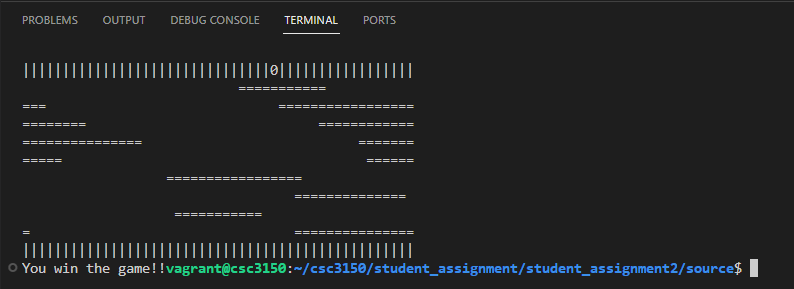
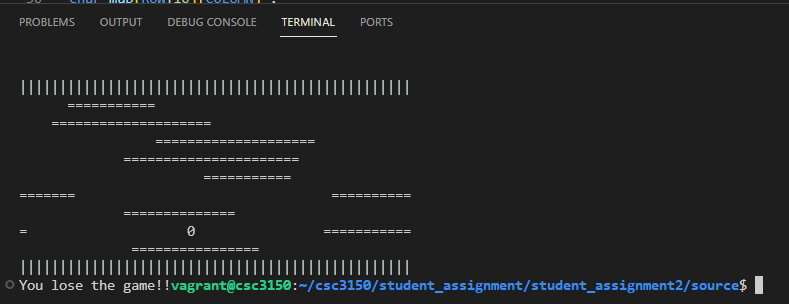
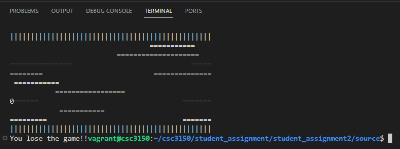
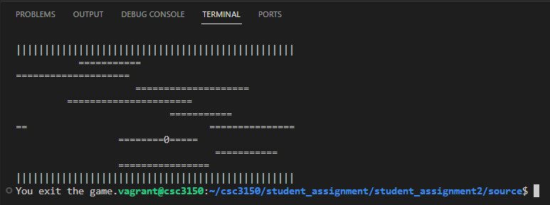

# CSC3150_Assignment2_Report 
## Liu Yuheng 120090263

## 1.Design

In this program, I have to degisn a game which has logs moving left and right in the river. 

* There are different parts in my program. First, I defined enunerate type "flag' and function **"check_over()"** which returns flag type to control the status of game. There are four types of flag, including 'win', 'gameover', 'continue' and 'quit'. Each of them handles different situations. 

* Second, the function  **'logs_move()'** controls the motion of logs. The parameter of this function is a void type pointer. I cast the address of Thread number to pointer and pass it to the function. Therefore, after dereference it, I can know which thread is running and also use this to determine th e moving direction of logs. In a while loop checking the FLAG is 'continue', I used **'usleep()'** to determine the hang time for each thread to control the moving speed of logs. Then, I obtain the length of logs which are generated randomly by methods which will be mentioned later. 

* For moving the logs, threads that has even TID move right (after plusing 1 to avoid 0) and others move left. My logic of moving are as follows. First, if logs move right, then check from right to left starting with the rightest element of the row. After finding **the first blank space and the left of which is a log (represented by '=')**, I then find the head because there is only one possible situation that has this combination, which is only at the head. However, if the log reaches the border, it will judge twice and therefore move twice. So I add a flag to control that it only move once in every iteration. To implement moving, I only change the head and tail, that is **moving head forward and eliminate tail.** Another 'if' condition checks whether the log has frog. If so, it deals with whether the frog is at head, body or tail. After each motion, it will check game status and update the frog's location. The same process is for moving left.

* Third, I have **'frog_move()** function to control the users' motion of frog. First, while loop check whether the game is continuing. Then, get the input character which includes 'w', 'a', 's', 'd', 'q' and thier upper case respectively stands for forward, left, backward, right and quit game. For 'w' case, I first check whether next step is movable. If so, I check different situations. For example,**after next step the game still continues, then update the location of logs and frog. If after the step the user wins, update coresponding information and the similar process if the game is over.** Other cases are similarly processed.

* Fourth, I write a print_state() function with parameter being FLAG to print different information about the game, lncluding whether it is over, lose or win.

* Last, in the main function, I set flag, initialize the location of logs and frog. Create 9 threads for logs and 1 threads for frog and join them.

About **lock and unlock**: frog_move() and logs_move() only lock the thread if the while loop checks the flag is 'continue'. After execution of each thread, it will unlock.

## 2.Environment
    Linux version:5.10.99

    Ubuntu version:16.04.12

    Virtual Box 6.1

## 3.Execution
    1.enter 'gcc hw2.cpp -lpthread' to compile
    2.enter './a.out' to run
    3.use 'w', 'a', 's', 'd' and 'q' to control frog (Uppercase works as well)

## 4.What I learned from this task

In the task, I tried to write my first multithread program. I have a deeper understanding how multithreads works together and how the logic might be different from sequential programs. I also know pthread library better. (Bonus not finished)

## 5.Execution screen shot

win

lose

lose

quit

